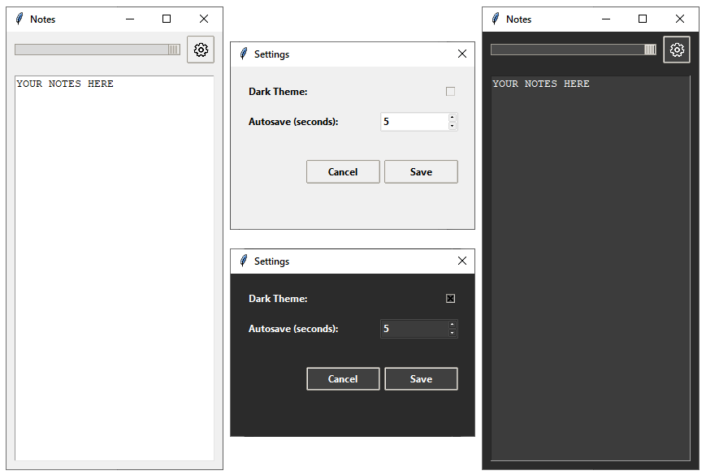

## Python pinned notes

- slider to change transparency of the window
- stores your notes in notes.txt
- stores the settings in settings.json (position of window, transparency)

### License

This project is licensed under the GNU General Public License v3.0.  
See the [LICENSE](LICENSE) file for the full text.